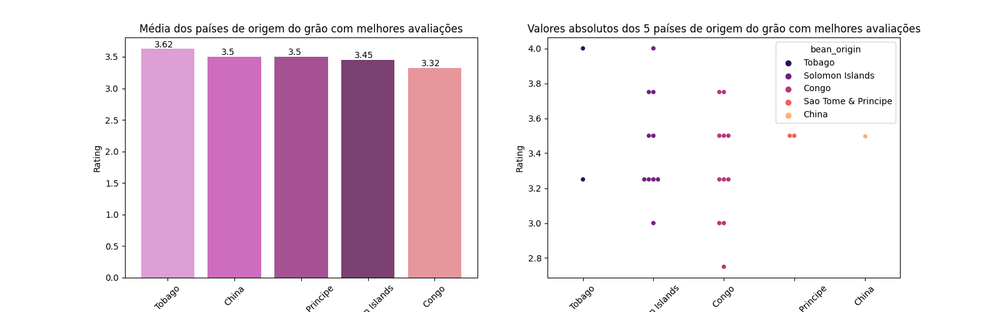
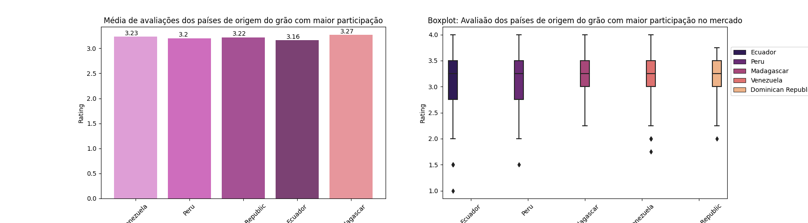
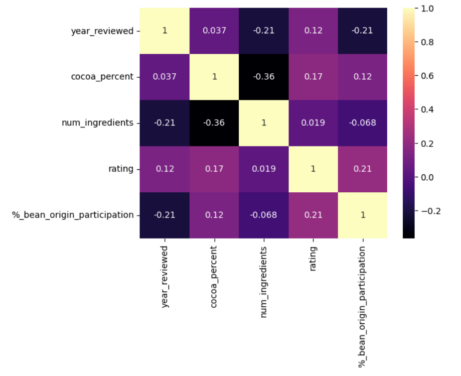
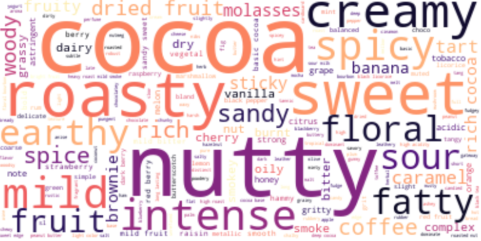
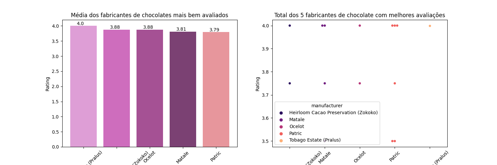
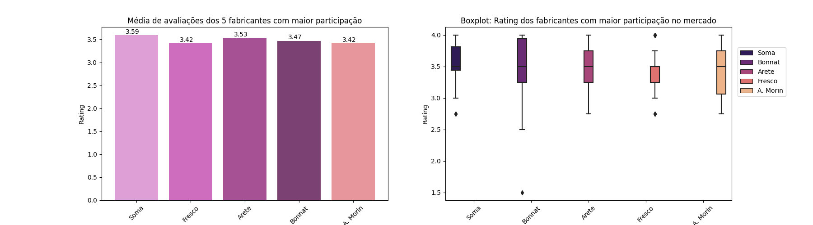

## Objetivo
Esse notebook tem como objetivos apresentar as seguintes análises:

1. Quais países de origem do grão resultam na classificação mais alta?
2. A porcentagem ou ingredientes de cacau afetam a classificação?
3. Com classificações altas, quais são as características mais memoráveis?
4. Quais são os fabricantes com barras de chocolate altamente avaliadas ?

O dataset [Chocolate Bar Ratings](https://www.kaggle.com/datasets/evangower/chocolate-bar-ratings) está disponível no Kaggle e possui as seguintes características:

Sistema de classificação de sabor: <br>
4.0 - 5.0 = Outstanding <br>
3.5 - 3.9 = Highly Recommended <br>
3.0 - 3.49 = Recommended <br>
2.0 - 2.9 = Disappointing <br>
1.0 - 1.9 = Unpleasant

#### Informações Técnicas
Utilizou-se as seguintes bibliotecas:
```
import pandas as pd
import seaborn as sns
import numpy as np
from wordcloud import WordCloud, STOPWORDS, ImageColorGenerator
import matplotlib.pyplot as plt
```
Ferramentas e tecnologias:
<div align="center">


</div>

### Conclusão
**Quais países de origem do grão resultam na classificação mais alta?** 

*Na média de avaliações: Tobago, China, São Tomé & Príncipe, porém ao observar a participação percentual de produtores no mercado, os com classificação mais altas são: Madagascar, Venezuela e República Dominicana.*

<div align="center" style="display: inline_block">
  
  
</div>

**A porcentagem ou ingredientes de cacau afetam a classificação?**

*Não evidências suficientes que provem que a porcentagem de cacau ou o número de ingredientes afetem a classificação*

<div align="center" style="display: inline_block">
  
</div>

**Com classificações altas, quais são as características mais memoráveis?**

<div align="center" style="display: inline_block">
  
</div>

**Quais são os fabricantes com barras de chocolate altamente avaliadas ?**

*Na média de avaliações:Tobago Estate(Pralus), Heirloom Cacao Preservation (Zokoko), Ocelot, porém ao observar a participação percentual de fabricantes no mercado, os com classificação mais altas são: Soma, Arete e Bonnat.*

<div align="center" style="display: inline_block">
  
  
</div>

<br>
<br>

<div align="center"> 
Última Atualização: Dez/2022 <br> 
⭐ se você gostou !!
</div>
<div align="center" style="display: inline_block"><br>
  
  <p><a href="https://giphy.com/gifs/musical-theater-charlie-and-the-chocolate-factory-d31uZkBBTy9zEVOM">via GIPHY</a></p>
</div>